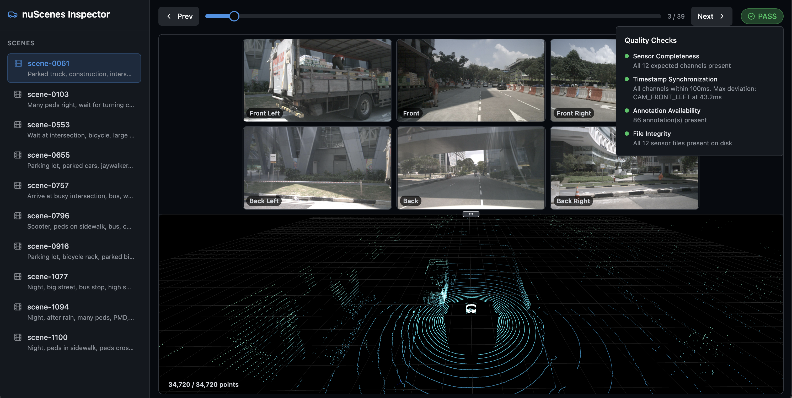
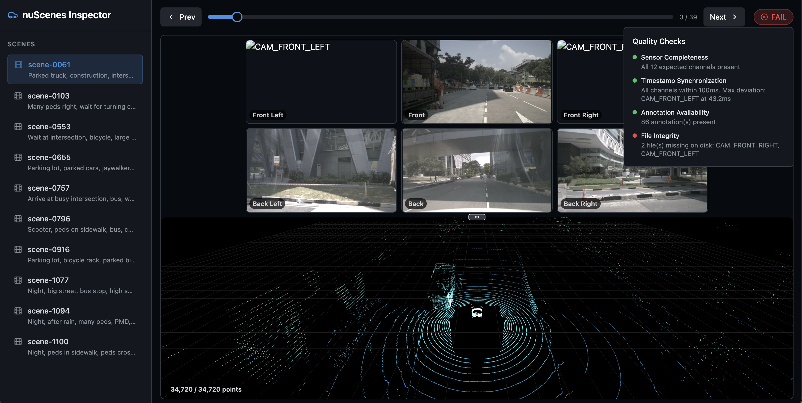

# nuScenes Multi-Sensor Data Inspector

A web-based system for exploring, visualizing, and inspecting the [nuScenes](https://www.nuscenes.org/) autonomous driving dataset.

## Architecture

```
Frontend (React + TypeScript)          Backend (FastAPI)
┌──────────────────────────┐     ┌──────────────────────────┐
│  Zustand (UI state)      │     │  routers/scenes.py       │
│  TanStack Query (server) │────▶│  services/nuscenes_svc   │──▶ nuScenes dataset
│  Three.js (3D LiDAR)     │     │  schemas/responses.py    │     (on disk)
│  Tailwind CSS (styling)  │     │  config.py (settings)    │
└──────────────────────────┘     └──────────────────────────┘
```

**Backend** exposes a REST API that wraps the `nuscenes-devkit`. It provides endpoints for listing scenes, retrieving frame data, serving camera images, returning LiDAR point clouds, and running data quality inspections.

**Frontend** renders a split-panel UI with a scene selector sidebar, frame navigation controls, a 6-camera image grid, a 3D LiDAR point cloud viewer, and a color-coded quality badge.

## Project Structure

```
backend/
  app/
    main.py              # FastAPI app, CORS, router mounting
    config.py            # Environment settings (pydantic-settings)
    routers/scenes.py    # REST endpoints with Pydantic response_model
    schemas/responses.py # Pydantic response models
    services/            # nuScenes devkit integration + quality inspection
  requirements.txt

frontend/
  src/
    main.tsx             # Entry point, QueryClientProvider, TooltipProvider
    App.tsx              # Root component, layout orchestration
    api/client.ts        # Typed fetch wrapper
    lib/utils.ts         # cn() utility for class merging (shadcn/ui)
    hooks/               # TanStack Query hooks (useScenes, useSamples, etc.)
    store/useAppStore.ts # Zustand global UI state
    components/
      ui/                # shadcn/ui primitives (Button, Badge, Skeleton, etc.)
      Layout.tsx         # Responsive shell with Sheet sidebar (mobile)
      SceneSelector.tsx  # Scene list with ScrollArea
      FrameNavigator.tsx # Navigation with Slider, Tooltip, Button
      CameraGrid.tsx     # 6-camera grid with Card wrappers
      LidarViewer.tsx    # Three.js point cloud (isolated from UI)
      QualityBadge.tsx   # Status Badge with Popover detail
      ErrorBoundary.tsx  # Catch boundary with retry
    types/api.ts         # TypeScript interfaces mirroring backend schemas
  components.json        # shadcn/ui configuration
```

## Prerequisites

- Python 3.10+
- Node.js 18+
- nuScenes dataset (at minimum `v1.0-mini`)

## Setup & Run

### Backend

```bash
cd backend
python -m venv venv
source venv/bin/activate
pip install -r requirements.txt
```

Set environment variables (or create a `.env` file in `backend/`):

```
NUSCENES_DATAROOT=/path/to/nuscenes
NUSCENES_VERSION=v1.0-mini
```

Start the server:

```bash
uvicorn app.main:app --reload --port 8000
```

### Frontend

```bash
cd frontend
npm install
npm run dev
```

The Vite dev server starts on `http://localhost:5173` and proxies `/api` requests to the backend on port 8000.

## API Endpoints

| Method | Path | Description |
|--------|------|-------------|
| GET | `/api/scenes` | List all scenes |
| GET | `/api/scenes/{token}/samples` | Ordered samples in a scene |
| GET | `/api/samples/{token}` | Sample detail (sensors, annotations, nav) |
| GET | `/api/samples/{token}/camera/{channel}` | Camera image (JPEG) |
| GET | `/api/samples/{token}/lidar?max_points=40000` | LiDAR point cloud (JSON) |
| GET | `/api/samples/{token}/quality` | Data quality inspection |

## Data Quality Checks

Each frame is inspected with four checks, each returning PASS / WARNING / FAIL:

| Check | PASS | WARNING | FAIL |
|-------|------|---------|------|
| **Sensor Completeness** | All 12 channels present | 1-2 missing | >2 missing |
| **Timestamp Sync** | All within 100ms of key-frame | Any exceeds threshold | — |
| **Annotations** | Annotations present | None available | — |
| **File Integrity** | All files on disk | — | Any missing |

The overall status is the worst-case across all checks.

### Quality Inspection Examples

| Status | Visual Representation | Description |
| :--- | :--- | :--- |
| **PASS** |  | **Ideal State:** All cameras and LiDAR are synced within <100ms. |
| **FAIL** |  | **Critical Issue:** Detected missing `CAM_FRONT_LEFT` and `CAM_FRONT_RIGHT` files on disk. |

## Controls

- **Scene selector**: Click a scene in the sidebar
- **Frame navigation**: Prev/Next buttons, timeline slider, or arrow keys
- **LiDAR viewer**: Click and drag to rotate, scroll to zoom, right-click to pan
- **Quality badge**: Click to expand check details

## Tech Stack

- **Backend**: Python, FastAPI, Pydantic, nuscenes-devkit
- **Frontend**: React 19, TypeScript (strict), Vite
- **UI Components**: shadcn/ui (Radix primitives)
- **Icons**: lucide-react
- **3D**: Three.js via React Three Fiber + Drei
- **Server State**: TanStack Query
- **Client State**: Zustand
- **Styling**: Tailwind CSS v4

## Demo Video

<div align="center">

[](https://youtu.be/EyeqaImWn3Y)

</div>

*Click the image above to watch the nuScenes Multi-Sensor Data Inspector in action.*
